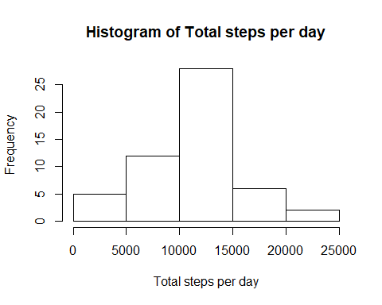
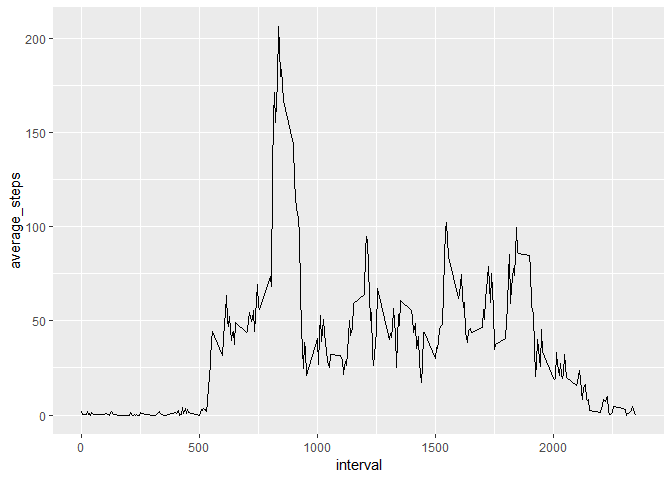
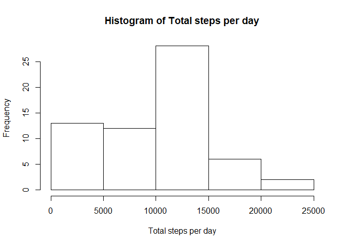
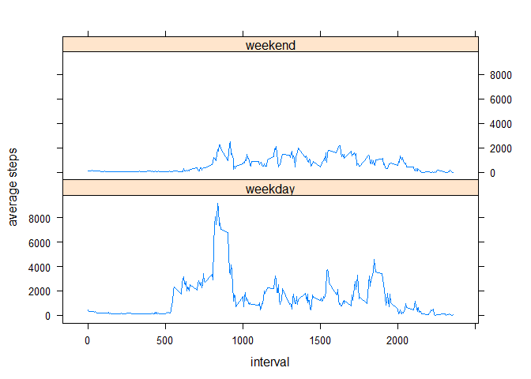

## Loading and preprocessing the data

```r
data<-read.csv("activity.csv")
head(data)
```

```
##   steps       date interval
## 1    NA 2012-10-01        0
## 2    NA 2012-10-01        5
## 3    NA 2012-10-01       10
## 4    NA 2012-10-01       15
## 5    NA 2012-10-01       20
## 6    NA 2012-10-01       25
```

## What is mean total number of steps taken per day?

```r
library(tidyverse)
```

```
## -- Attaching packages ---------------------------------------------------------------- tidyverse 1.2.1 --
```

```
## v ggplot2 3.1.0       v purrr   0.3.2  
## v tibble  2.1.1       v dplyr   0.8.0.1
## v tidyr   0.8.3       v stringr 1.4.0  
## v readr   1.3.1       v forcats 0.4.0
```

```
## -- Conflicts ------------------------------------------------------------------- tidyverse_conflicts() --
## x dplyr::filter() masks stats::filter()
## x dplyr::lag()    masks stats::lag()
```

```r
#Total number of steps taken per day
data2<- data%>%select(steps,date) %>% group_by(date) %>% summarise(total_steps= sum(steps))
data2
```

```
## # A tibble: 61 x 2
##    date       total_steps
##    <fct>            <int>
##  1 2012-10-01          NA
##  2 2012-10-02         126
##  3 2012-10-03       11352
##  4 2012-10-04       12116
##  5 2012-10-05       13294
##  6 2012-10-06       15420
##  7 2012-10-07       11015
##  8 2012-10-08          NA
##  9 2012-10-09       12811
## 10 2012-10-10        9900
## # ... with 51 more rows
```

```r
#plotting histogram of total number of steps per day
hist(data2$total_steps, xlab = "Total steps per day", main = "Histogram of Total steps per day")
```

<!-- -->

```r
#mean and median of total steps 
mean<-mean(data2$total_steps, na.rm = TRUE)
mean
```

```
## [1] 10766.19
```

```r
median<- median(data2$total_steps, na.rm = TRUE)
median
```

```
## [1] 10765
```
The mean number of steps taken per day is 10766.19 and the median is 10765.

## What is the average daily activity pattern?

```r
#Make a time series plot (i.e. type = "l") of the 5-minute interval (x-axis) and the average number of steps taken, averaged across all days (y-axis)
data3<-aggregate(x=list(average_steps=data$steps), by=list(interval=data$interval), FUN=mean, na.rm=TRUE)
head(data3, n= 20)
```

```
##    interval average_steps
## 1         0     1.7169811
## 2         5     0.3396226
## 3        10     0.1320755
## 4        15     0.1509434
## 5        20     0.0754717
## 6        25     2.0943396
## 7        30     0.5283019
## 8        35     0.8679245
## 9        40     0.0000000
## 10       45     1.4716981
## 11       50     0.3018868
## 12       55     0.1320755
## 13      100     0.3207547
## 14      105     0.6792453
## 15      110     0.1509434
## 16      115     0.3396226
## 17      120     0.0000000
## 18      125     1.1132075
## 19      130     1.8301887
## 20      135     0.1698113
```

```r
#plot(data3$interval, data3$average_steps, type= "l")
ggplot(data3, aes(x= interval, y= average_steps))+
        geom_line()
```

<!-- -->

```r
#Which 5-minute interval, on average across all the days in the dataset, contains the maximum number of steps?
data4<- aggregate(x=list(sum_steps=data$steps), by=list(interval=data$interval), FUN=sum, na.rm=TRUE)
data4<-arrange(data4,desc(sum_steps))
head(data4)
```

```
##   interval sum_steps
## 1      835     10927
## 2      840     10384
## 3      850      9720
## 4      845      9517
## 5      830      9397
## 6      820      9071
```
The 835 interval contains the highest number of steps across all the days on average.

## Inputing missing values

```r
#Calculate and report the total number of missing values in the dataset (i.e. the total number of rows with NAs)
data5<- data%>% filter(is.na(steps))%>% count()
data5
```

```
## # A tibble: 1 x 1
##       n
##   <int>
## 1  2304
```
The total number of missing values in the dataset is 2304

```r
#Devise a strategy for filling in all of the missing values in the dataset. The strategy does not need to be sophisticated. For example, you could use the mean/median for that day, or the mean for that 5-minute interval, etc.

# NA values will be equal to the maximum number of steps divided by 20
# new dataset with NAs removed
 
data6<- data
data6$steps[is.na(data6$steps)] <- data4$sum_steps/200
head(data6)
```

```
##    steps       date interval
## 1 54.635 2012-10-01        0
## 2 51.920 2012-10-01        5
## 3 48.600 2012-10-01       10
## 4 47.585 2012-10-01       15
## 5 46.985 2012-10-01       20
## 6 45.355 2012-10-01       25
```


```r
#. Make a histogram of the total number of steps taken each day
#. Calculate and report the mean and median total number of steps taken per day. Do these values    differ from the estimates from the first part of the assignment? 
#. What is the impact of inputing missing data on the estimates of the total daily number of steps?

#plotting histogram of total number of steps per day
data7<- data6 %>%select(steps,date) %>% group_by(date) %>% summarise(total_steps= sum(steps))
hist(data7$total_steps, xlab = "Total steps per day", main = "Histogram of Total steps per day")
```

<!-- -->

```r
mean2<- mean(data7$total_steps)
mean2
```

```
## [1] 9728.399
```

```r
median2<- median(data7$total_steps)
median2
```

```
## [1] 10395
```
The new mean after adding value to the NAs is 9728.399 and the new median is 10395. Adding new data has clearly changed the mean and median. In this case it has lowered it because the numbers added were smaller than the majority of the previously existing data.

## Are there differences in activity patterns between weekdays and weekends?

```r
#Create a new factor variable in the dataset with two levels - "weekday" and "weekend" indicating whether a given date is a weekday or weekend day.
data6$date<- as.character(data6$date)
data6$date<-as.Date(data6$date,"%Y-%m-%d")

data6$type<-ifelse(weekdays(data6$date) %in% c("Monday", "Tuesday", "Wednesday", "Thursday", "Friday"),"weekday", "weekend")
data6$type<- as.factor(data6$type)
head(data6)
```

```
##    steps       date interval    type
## 1 54.635 2012-10-01        0 weekday
## 2 51.920 2012-10-01        5 weekday
## 3 48.600 2012-10-01       10 weekday
## 4 47.585 2012-10-01       15 weekday
## 5 46.985 2012-10-01       20 weekday
## 6 45.355 2012-10-01       25 weekday
```

```r
#summary(data6$type)
```

```r
#Make a panel plot containing a time series plot (i.e.type="l") of the 5-minute interval (x-axis) and the average number of steps taken, averaged across all weekday days or weekend days (y-axis). See the README file in the GitHub repository to see an example of what this plot should look like using simulated data.
data8<-aggregate(x=list(avg_steps=data6$steps), by=list(interval=data6$interval, type = data6$type), FUN=sum, na.rm=TRUE)
head(data8)
```

```
##   interval    type avg_steps
## 1        0 weekday    418.81
## 2        5 weekday    329.52
## 3       10 weekday    298.60
## 4       15 weekday    293.51
## 5       20 weekday    285.91
## 6       25 weekday    331.13
```

```r
library(lattice)
xyplot(data8$avg_steps~data8$interval|data8$type, data = data8, layout=c(1,2), type="l", xlab = "interval", ylab="average steps")
```

<!-- -->
